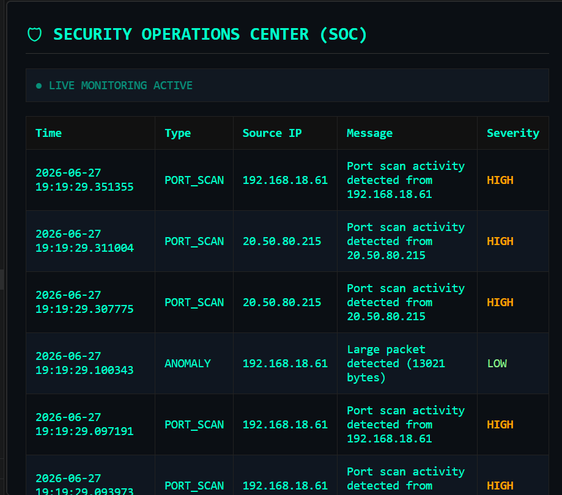
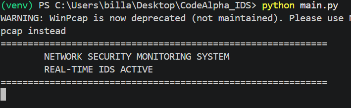

# 🛡 Network Intrusion Detection System (NIDS) — SOC Simulation

A real-time Network Intrusion Detection System (NIDS) built using Python, Scapy, and Flask.  
This project simulates a Security Operations Center (SOC) environment by monitoring network traffic, detecting suspicious activity, logging security events, and visualizing attacks through a dashboard.

---

## 🚀 Features

- Real-time network packet capture using Scapy
- Rule-based intrusion detection system
  - Port scan detection
  - ICMP traffic detection
  - Suspicious port monitoring
  - Packet activity logging
- Centralized event logging system (JSON-based)
- SOC-style Flask dashboard
- Live attack feed (auto-refresh API)
- Attack statistics visualization using Matplotlib

---

## 🧠 Detection Capabilities

- Port scanning detection
- ICMP traffic monitoring
- Suspicious port access detection (21, 22, 23, 445, 3389)
- Network packet capture logging

---

## 🏗 Project Structure

network-ids/
│
├── core/
│   ├── engine.py
│   ├── rules.py
│   └── state.py
│
├── utils/
│   └── logger.py
│
├── dashboard/
│   ├── app.py
│   ├── stats.py
│   ├── templates/
│   │   └── index.html
│   └── static/
│
├── data/
│   └── events.json
│
├── main.py
├── requirements.txt
└── README.md

---

## ⚙️ Installation

git clone https://github.com/your-username/network-ids.git
cd network-ids

python -m venv venv
venv\Scripts\activate

pip install -r requirements.txt

---

## ▶️ How to Run

Start IDS Engine:
python main.py

Start Dashboard:
python dashboard/app.py

Open browser:
http://127.0.0.1:5000

---

## 📊 Attack Graph

Generate visualization:
python dashboard/stats.py

---

## 📸 Screenshots

Dashboard:

Graph:

Terminal:

---

## 🛠 Tech Stack

- Python
- Scapy
- Flask
- Matplotlib
- JSON

---

## 🎯 Objective

To simulate a Security Operations Center (SOC) that:
- Monitors network traffic
- Detects intrusions
- Logs security events
- Visualizes attacks in real time

---

## ⚠️ Disclaimer

Educational use only.

---

## 👨‍💻 Author

ABDUL AHAD

Cybersecurity Project — Network Intrusion Detection System